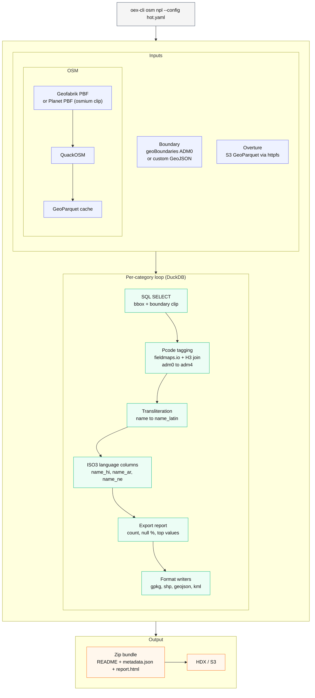

# Architecture

How oex turns an ISO3 country code into ready-to-use vector datasets.

## How it works

1. **Boundary** - resolves the country polygon from geoBoundaries CGAZ ADM0
   (or a custom GeoJSON) and derives a bounding box for all spatial queries.
2. **Data** - OSM: downloads the per-country PBF from Geofabrik (or clips
   from a local planet PBF) and converts it to GeoParquet once via QuackOSM.
   Overture: reads parquet directly from S3 over DuckDB httpfs, no download.
3. **Export loop** - for each category, DuckDB clips the cached parquet to
   the country boundary, applies column and tag filters, optionally tags every
   feature with administrative pcodes (adm1-adm4), transliterates names to
   Latin script, and writes the requested output formats.
4. **Bundle** - each format is zipped with a README and optional metadata
   JSON, then optionally uploaded to HDX or S3.

## Technical pipeline

**Query engine.** DuckDB runs embedded in the Python process and reads
GeoParquet files via memory-mapped columnar scans. Per-category exports are
DuckDB SQL SELECT statements with a bbox clip and `ST_Within` boundary filter.

**OSM path: Geofabrik to planet fallback to GeoParquet cache.**

The default OSM engine downloads the per-country PBF from Geofabrik.
For countries Geofabrik does not publish, oex falls back to a local planet
PBF:

1. The country boundary polygon is expanded by the configured
   `buffer_meters`, reprojected to EPSG:3857, buffered, then reprojected
   back to WGS84.
2. `osmium extract --strategy=complete_ways` clips the planet PBF to that
   polygon, producing a country-sized PBF.
3. [QuackOSM](https://github.com/kraina-ai/quackosm) converts the PBF to
   GeoParquet with tag filtering applied at parse time. The result is written
   to a local cache and reused on subsequent runs.
4. Per-category queries run as DuckDB SELECT statements over the cached
   parquet.

**Overture path: S3 parquet via httpfs.**
Overture Maps publishes release parquet at
`s3://overturemaps-us-west-2/release/<release>/theme=.../type=.../`.
DuckDB's httpfs extension reads these files with parallel HTTP range
requests, applying the bbox filter at the parquet page level.

**Pcode tagging: H3 index join.**
Admin pcodes are assigned in three stages:

1. **Cover** - each admin polygon (adm1-adm4) is filled with
   [H3](https://h3geo.org/) hexagonal cells at resolution 7 (~5.16 km²
   per cell). `MULTIPOLYGON` geometries are first decomposed into their
   constituent parts before coverage.
2. **Index** - each feature's centroid is converted to the H3 cell ID at
   the same resolution. The centroid is used for attribution: a building,
   road segment, school, or POI is assigned to the admin area it sits inside.
3. **Join** - the centroid cell ID is joined against the admin cell lookup
   on integer equality. Features whose centroid falls on a shared cell
   boundary are resolved with a `ST_Contains` point-in-polygon check.

## Performance

Full HOT 12-category schema for **Brazil** on a 20 GB Docker container,
single worker, 4 CPU cores. DuckDB memory limit: 60% of container RAM (~12 GB).

| Category            | Features   | Export time |
| ------------------- | ---------- | ----------- |
| Buildings           | 11,246,007 | 7.5 min     |
| Roads               | 8,000,187  | 12.7 min    |
| Waterways           | 1,870,423  | 13.4 min    |
| Railways            | 17,269     | 3.2 min     |
| Education           | 111,358    | 3.5 min     |
| Health              | 43,989     | 3.1 min     |
| Populated places    | 197,969    | 3.5 min     |
| Financial services  | 17,409     | 2.7 min     |
| Airports            | 28,392     | 2.8 min     |
| Sea ports           | 1,723      | 2.6 min     |
| Points of interest  | 846,550    | 4.7 min     |
| Cultural places     | 88,388     | 2.9 min     |
| **Total**           | **~22 M**  | **~63 min** |

**Peak memory: ~5.7 GB** across the full run (measured during pcode tagging
of the 11.2 M building category).

Pcode tagging cost is largely independent of feature count: Brazil's admin
tessellation produces ~1.54 M H3 cells per admin level and all four levels
are built per category, accounting for ~3-4 min of each category's runtime.
